# FindReason RAG 归因 Skill 最新架构

本文说明当前工作区最新的 `findreason-rag-attribution` skill 架构。核心变化是：从固定 probe 流程，升级为“Agent 现场侦查 + 动态验证 backlog + CLI 确定性证据 + orchestrate 反事实仲裁”。

## 0. 一句话总览

FindReason 不是一个自动猜原因的黑盒。宿主 Agent 负责理解 case、读 trace、构造断言和验证计划；CLI 负责拉取 trace、执行验证、绑定 evidence、生成稳定 JSON，并用 counterfactual 规则选择单一 `primary_cause`。

```mermaid
flowchart LR
  U[用户/表格 badcase] --> A[宿主 Agent]
  A -->|标准化 case + hints| I[ingest-fornax-trace]
  I -->|trace + raw_artifacts + suggested probes| A
  A -->|现场侦查| B[动态诊断 backlog]
  B --> C[assertion set<br/>host_agent.answer_claim]
  B --> D[{stage}-exp / probe-v1 plan]
  D --> P[probes / run-probe-plan]
  C --> I2[必要时重新 ingest]
  I2 --> O[orchestrate]
  P --> O
  O --> R[primary_cause<br/>secondary_findings<br/>evidence_chain<br/>case_report]
```

## 1. 系统边界

当前正式入口和实现：

- CLI 入口：`scripts/findreason.py`
- v3 主实现：`scripts/findreason_core/v3.py`
- Trace 解析：`scripts/findreason_core/fornax_trace.py`
- Workflow fallback：`scripts/findreason_core/workflow_replay.py`
- 规则与契约：`SKILL.md`、`references/*.md`

旧的 `agent_graph` / `diagnostics` / `skills/specs` 路径不再作为主流程规则源。

```mermaid
flowchart TB
  subgraph Host["宿主 Agent：语义与编排"]
    H1[读用户 case / 表格行]
    H2[压缩 evaluator signals]
    H3[读取 trace 现场]
    H4[生成 expected_required / answer_claim]
    H5[生成动态 {stage}-exp backlog]
    H6[撰写面向人的报告]
  end

  subgraph CLI["FindReason CLI：确定性证据引擎"]
    C1[ingest-fornax-trace]
    C2[probe-* / run-probe-plan]
    C3[evidence binding]
    C4[orchestrate]
    C5[JSON + case_report.md]
  end

  H1 --> C1
  C1 --> H3
  H3 --> H4
  H3 --> H5
  H4 --> C1
  H5 --> C2
  C2 --> C4
  C1 --> C4
  C4 --> C5
  C5 --> H6
```

### 职责分工

| 模块 | 能做什么 | 不能做什么 |
|-|-|-|
| 宿主 Agent | 理解语义、抽取断言、判断要验证哪个环节、组织报告 | 不能把未执行 hypothesis 当证据 |
| CLI ingest | 拉取 Fornax trace、解析中间节点、输出 raw artifacts | 不能从 query / judgement 自动发明 expected_required |
| probes / run-probe-plan | 执行确定性 hit/miss，输出 evidence | 不能决定 primary cause |
| orchestrate | 合并 evidence、按阶段和 counterfactual 仲裁 | 不能跳过上游证据直接下沉到 answer |
| report renderer | 给出结构化报告索引和人读 markdown | 不能替代审计 JSON |

## 2. 端到端运行链路

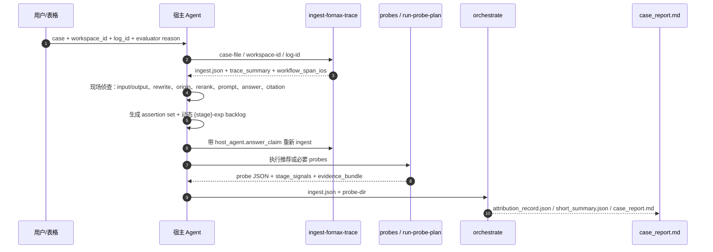

## 3. Ingest：把历史现场变成可验证 artifacts

`ingest-fornax-trace` 是所有归因的起点。它拉取 OpenPlat trace detail，并抽取 workflow 输入/输出、中间 RAG 节点、召回/重排/prompt 文档、最终答案和 trace 完整性。

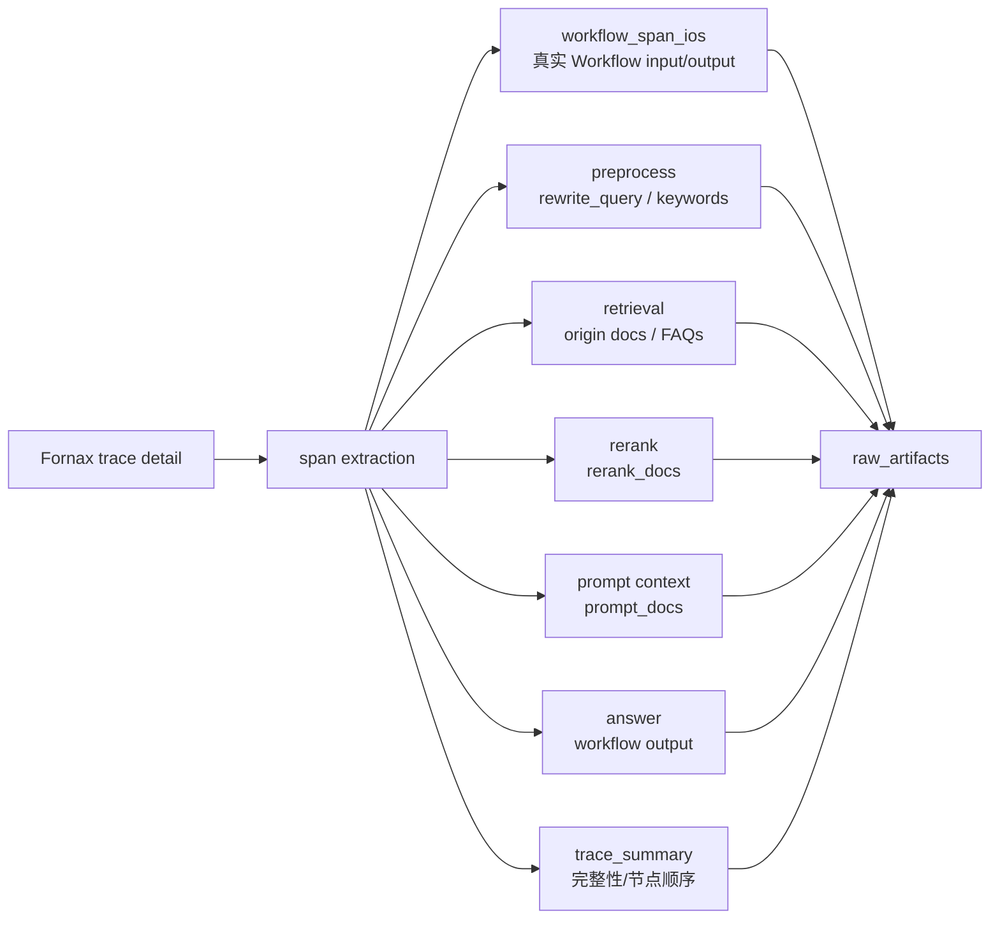

`ingest_summary` 会给出：

- `trace_completeness`：各阶段证据是否完整。
- `suggested_probe_set`：当前建议执行哪些 probes。
- `skip_reason`：不建议执行某些 probes 的原因。
- `host_action_required`：例如 `generate-probe-plan`、`extract_host_agent_answer_claim`、`replay-workflow`。

## 4. 字段边界：不要混用四类上下文

这版 skill 最重要的边界是：外部 query/answer 只是 hint，不能覆盖真实 workflow 输入输出。

```mermaid
flowchart TB
  subgraph External["外部线索，只能辅助理解"]
    QH[query_hint / 表格 query]
    AH[answer_hint / evaluator answer]
    EV[evaluator reason / judgement_evidence.signals]
  end

  subgraph TraceTruth["Trace 权威现场"]
    WI[raw_artifacts.workflow_span_ios[].input<br/>Workflow 原始输入]
    WO[raw_artifacts.workflow_span_ios[].output<br/>Workflow 原始输出]
  end

  subgraph Internal["Workflow 内部预处理"]
    RW[rewrite_query]
    KW[keywords]
  end

  QH -.辅助生成 assertion.-> ER[expected_required]
  EV -.压缩为怀疑点.-> ER
  WI --> ER
  WO --> AC[answer_claim]
  WI --> RW --> KW --> Recall[online recall]

  AH -.只有 trace 缺 answer 时才 fallback.-> WO
```

判断顺序：

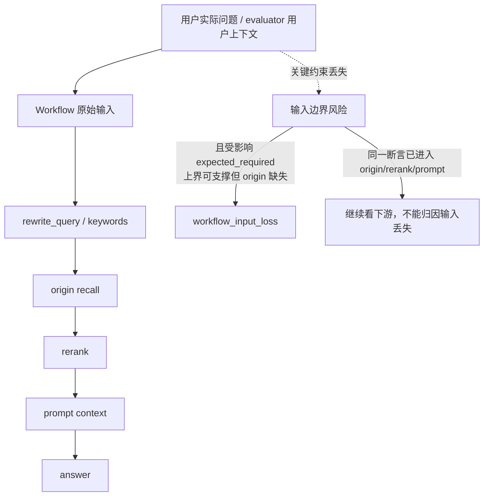

## 5. Agent 现场侦查：先观察，再验证

宿主 Agent 在生成断言和 probe 前，需要先做现场侦查。现场侦查不直接产出主因，只决定下一步要验证什么。

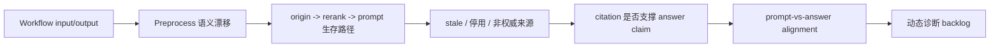

每个 backlog item 至少记录：

| 字段 | 含义 |
|-|-|
| `trigger_source` | 线索来自 evaluator、trace、rewrite、origin、rerank、prompt、answer、citation、chunk 等 |
| `trigger_observation` | 观察到的具体现象 |
| `hypothesis` | 待验证假设 |
| `exp_kind` | `retrieval-exp`、`rerank-exp`、`answer-exp`、`citation-exp`、`chunk-conflict-exp` |
| `target_stage` | 预期影响的阶段 |
| `expected_evidence` | 执行后希望看到的证据类型 |

## 6. 动态验证环节 `{stage}-exp`

用户可见验证环节统一按 `{stage}-exp` 表达。`run-probe-plan` 只是兼容执行器，用于静态 artifact 命中验证，不是覆盖所有场景的通用 probe。

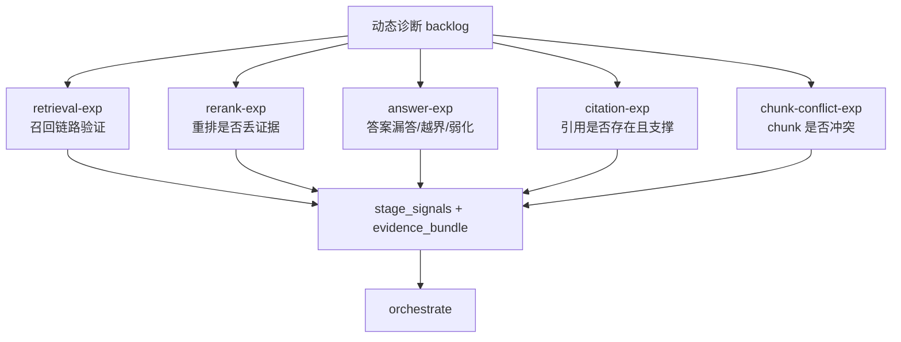

常用映射：

| 检查目的 | direction | target_artifact |
|-|-|-|
| 正确答案要求是否有 KB 上界支撑 | `coverage_gap` | `kb_wide_recall` |
| KB 支撑是否进入线上初召回 | `coverage_gap` | `online_origin_recall` |
| 初召回支撑是否经过 rank / rerank | `coverage_gap` | `rerank_output` |
| 支撑是否进入 prompt/context | `coverage_gap` | `prompt_context` |
| 输出是否越过用户约束范围 | `scope_violation` | `answer_span` 或 `kb_wide_recall` |
| 引用是否存在且支撑 claim | `citation_missing` | `online_origin_recall` / `rerank_output` / `prompt_context` |
| chunk 是否存在冲突 | `internal_contradiction` | `online_origin_recall` / `rerank_output` / `prompt_context` |

## 7. Assertion Set：唯一入口和两个核心 role

所有断言只能进入 `host_agent.answer_claim`。不要再把断言放进旧字段。

```mermaid
flowchart LR
  Agent[宿主 Agent] --> HAC[host_agent.answer_claim[]]
  HAC --> ER[expected_required<br/>正确答案必须覆盖]
  HAC --> AC[answer_claim<br/>workflow output 中的命题 X]
  HAC --> CK[constraint/citation/consistency checks]

  ER --> Up[驱动 knowledge / retrieval / rerank / context]
  AC --> Ans[驱动 answer grounding / scope / citation / consistency]
  CK --> Ans

  AC -.不能反推.-> ER
```

### `expected_required`

- 含义：正确输出应覆盖的检查点。
- 来源：trace query、chat history、evaluator reason、rewrite query、keywords、prompt 中关键限制、现场观察。
- 性质：归因靶子，不是事实证据。
- 用途：驱动 knowledge、retrieval、rerank、context 覆盖链。

### `answer_claim`

- 含义：从 workflow output 中抽出的可验证命题 X。
- 正确写法：`品牌客户可以在后台的“品牌投放-品牌竞价”找到一元试投入口。`
- 错误写法：`答案称品牌客户可以...`
- 用途：answer grounding、scope、citation、consistency 检查。
- 不允许：反推出上游 `expected_required`。

## 8. expected_required 保守语义去重

CLI 会在进入 `point_coverage` 前做保守合并。只有两条断言是“场景约束 + 同一入口/路径要求”的包含或细化关系，才合成一条覆盖靶子。

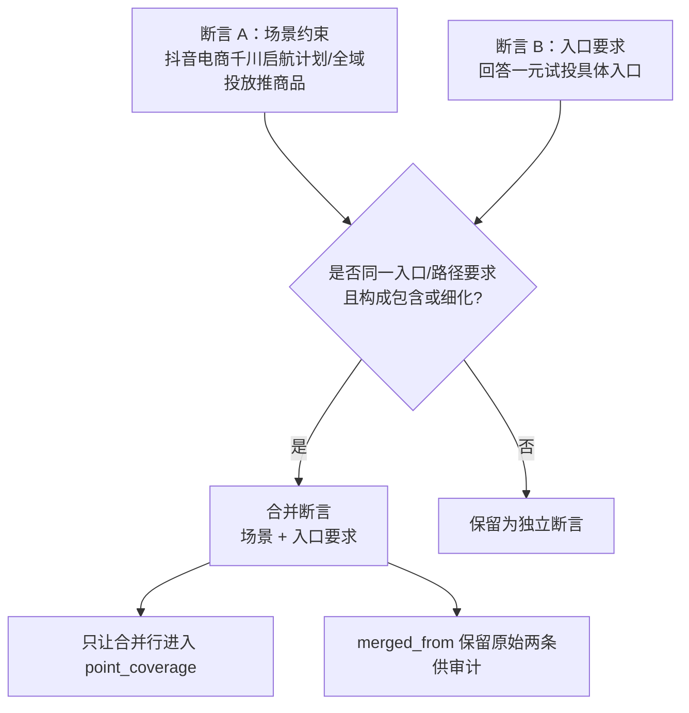

合并规则：

- `basis` 取并集，例如 `trace_query`、`chat_history`、`evaluator_reason`。
- 原始断言写入 `merged_from`。
- 原始两条不再重复进入 coverage 矩阵。
- 不做泛化合并；语义不确定时宁可不合并。

## 9. 断言覆盖链：上游归因的主骨架

`expected_required` 的覆盖链是当前 skill 的核心。只有正文中包含 `full_support` 或 `partial_support` 片段，才算覆盖；标题命中、纯词面命中、doc ID 生存都不能单独作为覆盖。

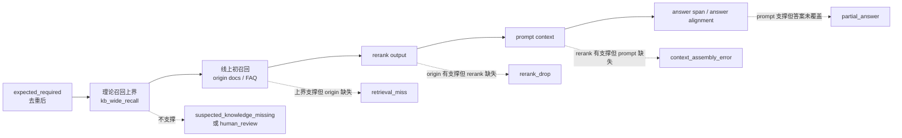

覆盖矩阵聚焦线上阶段：

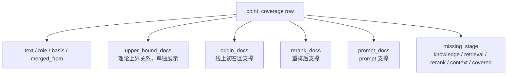

## 10. Probe 输出如何进入 orchestrate

所有 probes 输出统一 envelope：

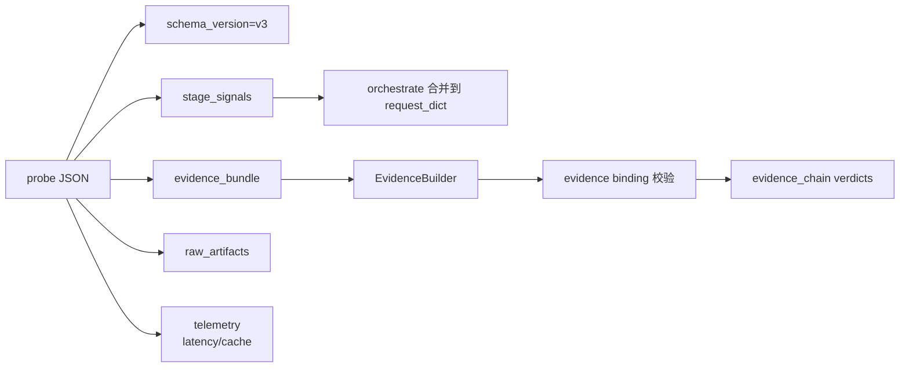

`run-probe-plan` 输出里，`probe_id` 是宿主 Agent 在 plan 中命名的验证项 ID。CLI 原样保留，并生成：

- `hit`
- `matched_docs`
- `matched_terms`
- `converged_direction`
- `evidence_id = run-probe-plan:<probe_id>`
- 可选元数据：`display_name`、`exp_kind`、`trigger_source`、`trigger_observation`、`hypothesis`

## 11. Orchestrate：合并证据并选择单一主因

`orchestrate` 会读取 `ingest.json` 和 `probe-dir`，合并所有 `stage_signals`，构建 `evidence_bundle`，推断各阶段 verdict，校验证据绑定，然后选择主因。

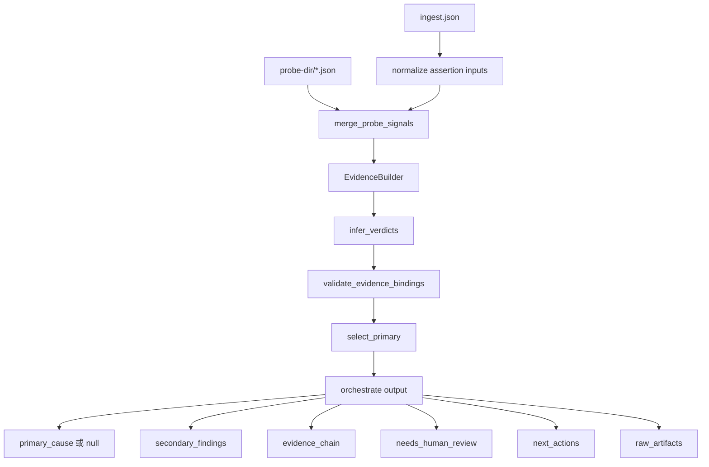

阶段顺序固定：

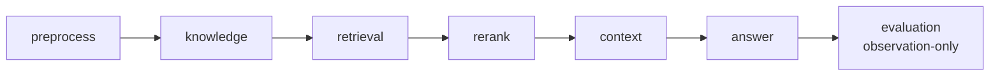

主因选择规则：

1. 按 `preprocess -> knowledge -> retrieval -> rerank -> context -> answer -> evaluation` 遍历。
2. 跳过 `upstream_blocked_by` 的 verdict。
3. 跳过 `not_probed`。
4. 选择第一个失败、counterfactual 可用、且 `downstream_would_change=true` 的阶段。
5. 如果更早阶段未解决，不选择下游失败作为主因。
6. 如果没有有效上游 counterfactual，输出 `primary_cause=null` 和 `needs_human_review=true`。

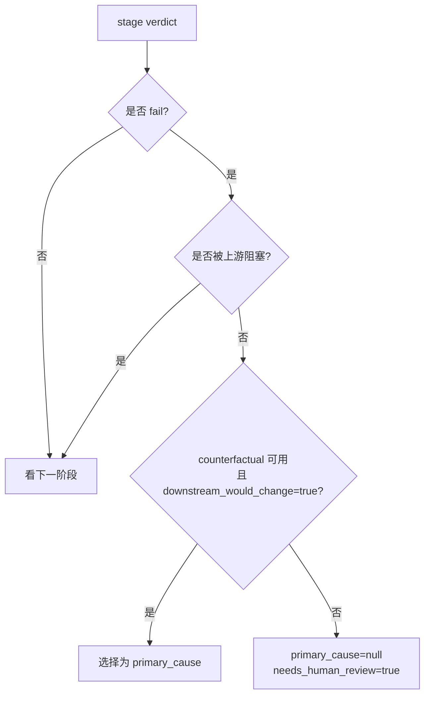

## 12. Answer 与 secondary findings

这版架构区分“单主因”和“多发现”：

- `primary_cause` 仍是单一枚举。
- answer 漏答、错引、越界、unsupported claim、branching unclear、chunk conflict 风险等，可以进入 `secondary_findings`。
- 如果上游证据不足，不能因为答案看起来错了就直接下沉到 answer cause。

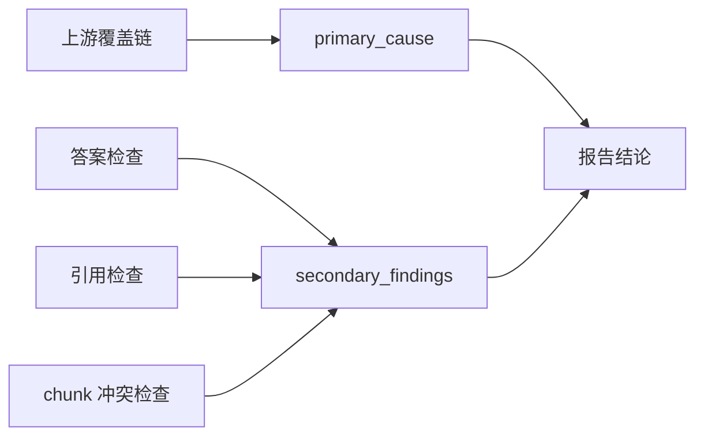

答案类主因的基本前置条件：

- `qa.prompt_supports_answer=true`
- `qa.answer_satisfies_expected=false`
- 上游没有更早且 counterfactual 成立的失败

如果 `prompt_supports_answer=false`，主因应停在上游。

## 13. Cause code 分层

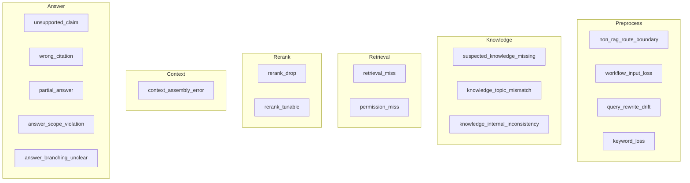

Evaluation 在 v3 中是观察层，没有官方 cause code。

## 14. Workflow replay 的位置

Trace 是历史现场事实。只有 trace 查询失败或缺少中间节点证据时，才使用 workflow replay。Replay 不能替代已有 trace 证据，也不能与 probes 并行。

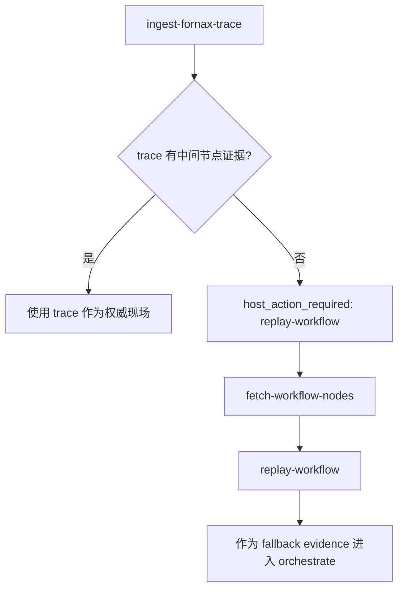

## 15. 输出物

`orchestrate --output-dir` 会输出三个核心文件：

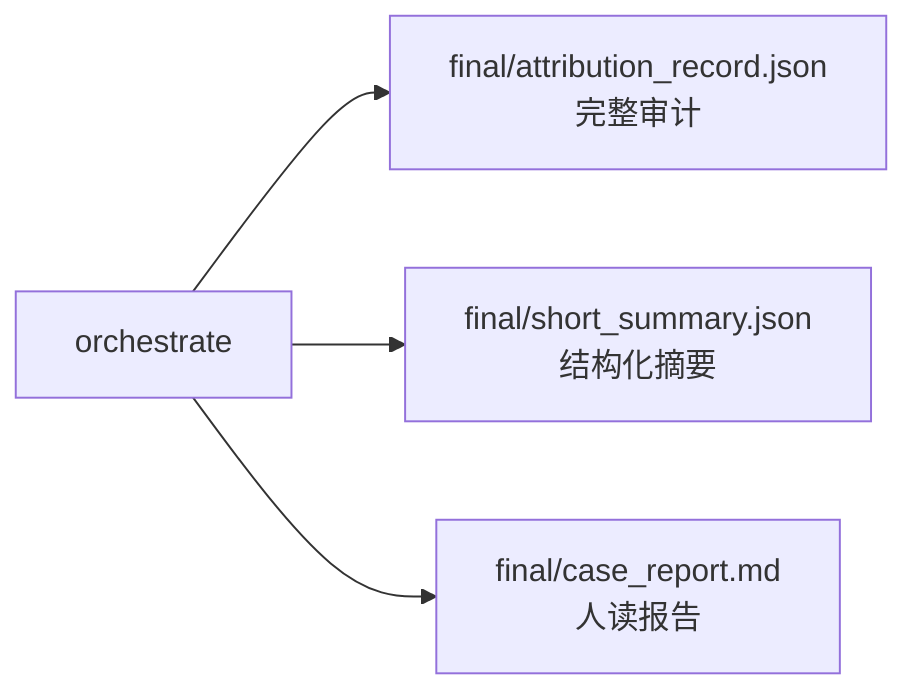

顶层输出包含：

- `schema_version`
- `log_id`、`workspace_id`、`app_id`
- `oracle_status`
- `case_assessment`
- `primary_cause`
- `secondary_findings`
- `failure_patterns`
- `needs_human_review`
- `human_review_reasons`
- `evidence_bundle`
- `evidence_chain`
- `next_actions`
- `telemetry`
- `raw_artifacts`

## 16. 快速排障图

```mermaid
flowchart TB
  A[case 进来] --> B{有 workspace_id + log_id?}
  B -->|否| X[无法进入标准 trace 主链路]
  B -->|是| C[ingest-fornax-trace]
  C --> D{trace 完整?}
  D -->|否| R[replay-workflow fallback]
  D -->|是| E[现场侦查]
  E --> F{有 expected_required?}
  F -->|否| G[generate-probe-plan<br/>补 host_agent.answer_claim]
  F -->|是| H[运行必要 probes / {stage}-exp]
  G --> C
  H --> I[orchestrate]
  I --> J{primary_cause 是否 null?}
  J -->|是| K[看 human_review_reasons<br/>补证据/断言/counterfactual]
  J -->|否| L[按 owner + next_actions 修复]
```

## 17. 关键边界清单

```mermaid
mindmap
  root((FindReason 边界))
    证据
      未执行 backlog 不是证据
      probe-v1 plan 不是证据
      hit/miss + support spans 才是证据
    字段
      host_agent.answer_claim 是唯一断言入口
      外部 query/answer 只是 hint
      workflow_span_ios 是真实输入输出
      旧断言字段 fail fast
    覆盖
      只有 expected_required 驱动上游归因
      answer_claim 不反推 expected_required
      标题命中不算覆盖
      doc ID 生存不单独触发 rerank/context
    仲裁
      单 primary_cause
      多 secondary_findings
      上游未解不下沉答案
      counterfactual 必须可回指 evidence
```

## 18. 推荐的人读报告组织

报告应优先回答“问题最早断在哪”，而不是堆 JSON：

1. 结论摘要：`primary_cause`、owner、confidence、是否需要人工复核。
2. 现场输入与答案：log、workspace、app、真实 query、原始答案、文档数量。
3. 验证过程：执行了哪些 `{stage}-exp`，为什么执行。
4. 阶段裁决：preprocess 到 answer 每阶段 verdict。
5. 关键证据与文档：必要断言、覆盖矩阵、理论召回上界关系、answer findings、chunk conflict findings。
6. 下一步建议：owner 和 P0/P1 action。
7. 审计 JSON 索引：指向 `attribution_record.json` 中的原始 trace、probe outputs、workflow I/O。

## 19. 当前架构的设计取舍

```mermaid
flowchart LR
  A[Agent 负责语义] --> P[更灵活地处理不同 workflow / case]
  B[CLI 保持确定性] --> Q[结果可复核、可回归]
  C[断言覆盖链] --> R[避免 doc ID 误判]
  D[counterfactual 仲裁] --> S[避免下游表象掩盖上游断点]
  E[secondary_findings] --> T[保留复合问题，不破坏单主因]
```

这版 skill 的核心目标是把“看起来像错因”的观察，全部降级为 hypothesis；只有被 trace/probe 支撑、能绑定 evidence、且 counterfactual 成立的阶段，才可以成为 `primary_cause`。
